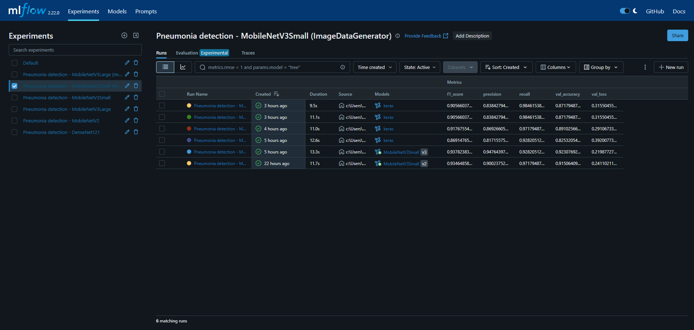

# Détection de pneumonie par vision par ordinateur (Transfer Learning & MLflow)

*Projet réalisé par [Aurélien Leva](https://github.com/Aurelien-L) dans un contexte pédagogique durant la formation Développeur en Intelligence Artificielle, chez Simplon Hauts-de-France.*

## Sommaire
1. [Arborescence](#arborescence)
2. [Description du projet](#description-du-projet)
3. [Outils utilisés](#outils-utilisés)
4. [Installation](#installation)
5. [MLflow](#mlflow)
6. [Démarche du projet](#démarche-du-projet)


## Arborescence

```
CNN_Transfer_Learning/
├── data/                   # dossier contenant les datas
│   ├── train/
│   ├── val/
│   └── test/
├── img/                    # illustrations
│   ├── banner.png
│   └── mlflow.PNG
├── Notebook_CNN_TL.ipynb   # fichier principal du projet
├── README.md
├── requirements.txt
└── LICENCE
```


## Description du projet
Projet de mise en place d'un système de classification binaire permettant de détecter des cas de pneumonie à partir de radios thoraciques, via utilisation d'un *modèle de vision par ordinateur pré-entraîné* type *CNN*. Utilisation du dataset *[Chest X-Ray Pneumonia](https://www.kaggle.com/datasets/paultimothymooney/chest-xray-pneumonia)*.

Appréhension d'une démarche de suivi des expérimentations par *MLflow*, afin de tracer les paramètres d’entraînement, les métriques de performance et les versions de modèle.

**Contexte du projet** : Une équipe médicale souhaite tester l’apport de l’intelligence artificielle dans le diagnostic automatisé de la pneumonie à partir de radios thoraciques. Elle a besoin d’un prototype fonctionnel (Proof of Concept) permettant de démontrer la faisabilité d’un système de classification binaire d’images médicales.


## Outils utilisés
Liste des outils et modules utilisés pour le projet :
* [Python](https://www.python.org/downloads/release/python-31010/) : Version 3.10.10 
* Numpy
* Matplotlib
* Opencv-python
* Tensorflow : Version 2.19.0
* Scikit-learn
* MLflow


## Installation
Pour utiliser ce projet, téléchargez le .zip [ici](https://github.com/Aurelien-L/CNN_Transfer_Learning/archive/refs/heads/main.zip), ou clonez le projet sur votre ordinateur avec la commande suivante : 
```
$ git clone https://github.com/Aurelien-L/CNN_Transfer_Learning.git
```
>[!WARNING]
>Assurez-vous d'avoir Python 3.10.10 d'installé sur votre machine, et installez les dépendances nécessaires avec cette commande :
```
pip install -r requirements.txt
```


## MLflow
Pour pouvoir accéder au serveur local MLflow, utilisez la commande suivante dans le terminal.

>[!WARNING]
>Attention, veillez à bien exécuter MLflow **avant** de lancer l'exécution du Jupyter NoteBook, sinon la cellule dédiée amènera à une erreur.

```
mlflow ui
```
Le serveur sera disponible à l'adresse suivante : *http://127.0.0.1:5000/*


## Démarche du projet

### Choix du modèle
\
Suite à comparatif de différents modèles pré-entraînés, les premiers essais ont été réalisé avec **DenseNet121**. Ce dernier est particulièrement adapté au cas de ce projet, étant très utilisé dans le milieu médical pour la détection de maladies pulmonaires. Il demande cependant beaucoup de puissance de calcul, et donc de temps d'exécution, ce qui m'empêchait de travailler efficacement.  

J'ai donc décidé de travailler avec un autre modèle *plus léger*, bien que moins adapté, par souci pédagogique, dans le but de me concentrer principalement sur l'exécution globale et la démarche de travail, plus que sur les résultats du modèle.

_____________________________

\
Pour commencer, mon choix s'est tourné vers **MobileNetV2**, un modèle CNN léger, rapide et efficace, optimisé pour les appareils mobiles et embarqués (demandant donc beaucoup moins de ressources que des architectures comme VGG16, ResNet etc.), tout en offrant une bonne précision. Ses résultats étaient corrects, mais je voulais essayer d'obtenir mieux.

J'ai ensuite essayé **MobileNetV3**, évolution de la V2, dans sa version **Small**. Cette version est principalement utilisée avec des appareils très limités comme les microcontrôleurs. Ses résultats étaient très bons. Le modèle était très rapide, léger et possédait une bonne précision. 


J'ai réalisé un dernier essai avec la version **Large** de **MobileNetV3**. Optimisé pour les appareils un peu plus puissants (comme nos téléphones modernes), elle possède deux fois plus de paramètres que la version Small. Elle est donc certes plus lente, mais aussi plus précise. C'est cette version qui sera utilisée pour la version finale de mon modèle.

_____________________


### Prétraitement
\
Avant l'entraînement du modèle, les images sont préalablement préparées :
- en les filtrant pour éviter les images illisibles.
- en les redimensionnant avec un padding pour éviter les déformations.
- en étant prétraitées avec un ImageDataGenerator, qui permet également de faire de la Data Augmentation (rotation, zoom, miroir, etc.) pour éviter l'overfitting.
- en étant normalisées avec la fonction preprocess_input (fonction dédiée à la normalisation des données pour MobileNetV3).


\
Les poids des classes sont aussi rééquilibrés afin d'améliorer l'apprentissage, et éviter que le modèle ne favorise les classes majoritaires.

___________


### Création du modèle
\
Le modèle de base est importé sans sa dernière couche afin d'ajouter celles qui nous intéressent. Ses couches sont initialisées avec leurs poids d'origine (*ImageNet*) et gelées pour ne pas être altérées, puis un premier entraînement est fait avant de dégeler quelques unes des dernières couches, afin de finir avec un deuxième entraînement pour affiner le modèle.

Ce dernier est évalué par taux de précision, taux de perte, rapport de classification, matrice de confusion et courbe ROC. 

\
*Les résultats des différents modèles utilisés et des différentes simulations sont visibles grâce à l'historique MLflow, et le modèle peut également y être téléchargé.*

